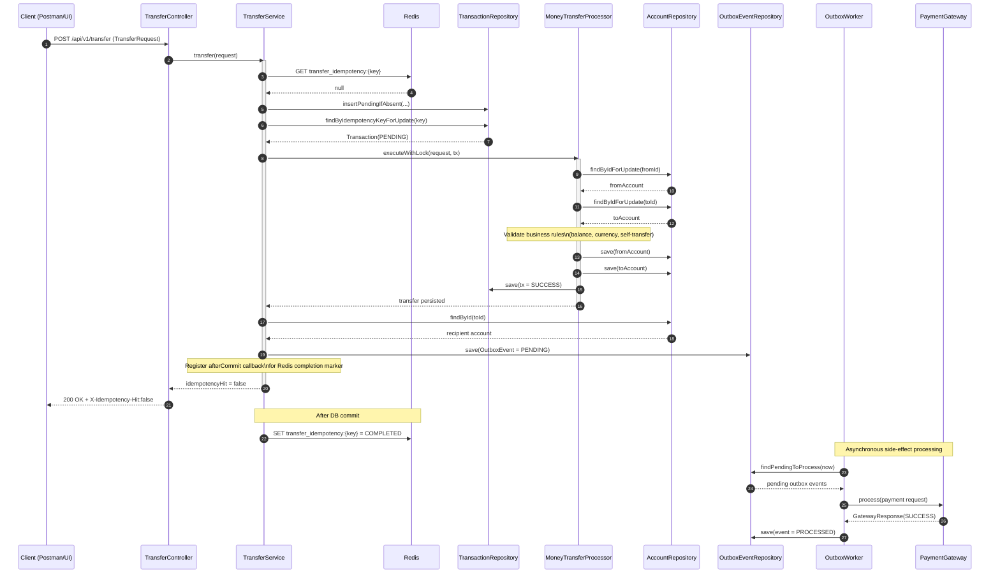
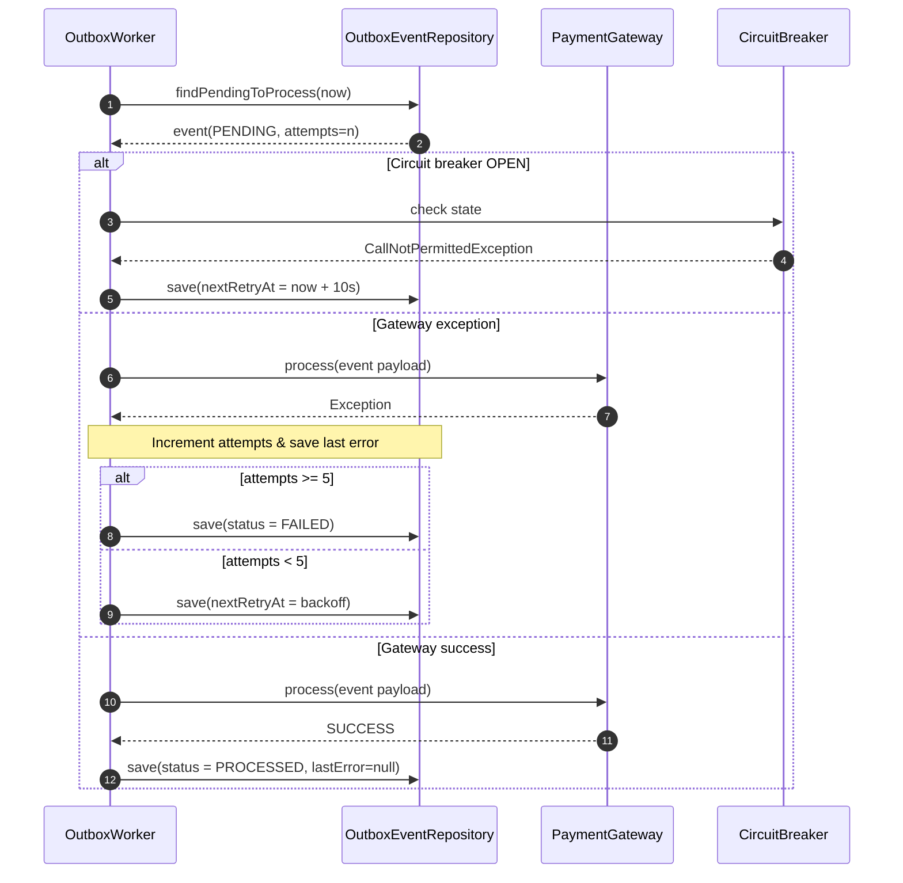

# GlobalPay

**GlobalPay** is a production-minded payment engine built with **Java 21**, **Spring Boot 3.4**, **PostgreSQL**, and **Redis**.

This repository focuses on payment-system concerns that are usually skipped in CRUD demos:

- concurrency safety for balance integrity
- idempotent request handling under retries
- transactional consistency and explicit state transitions
- reliable async side effects with **Transactional Outbox**
- observability and load validation with Prometheus/Grafana + k6

---

## Why this project is interesting

Moving money is not only about writing two rows in a database.
Real complexity appears when locking, retries, idempotency, and external integrations interact under load.

GlobalPay v2 addresses this with practical reliability patterns:

- pessimistic row locking on accounts
- two-layer idempotency (DB state + Redis fast-path replay)
- transaction lifecycle (`PENDING -> PROCESSING -> SUCCESS | FAILED`)
- `afterCommit` Redis synchronization to avoid cache/DB drift
- **Transactional Outbox** for external side effects
- retry/backoff + **Circuit Breaker** around gateway communication
- integration tests with Testcontainers (including outbox behavior)

---

## Core API

- `POST /api/v1/transfer` - execute a transfer
- `GET /api/v1/transfer/accounts/{accountId}/transactions` - paginated account history

### Transfer response behavior

Successful transfer request returns HTTP `200` and:

- body: `Transfer successful`
- header: `X-Idempotency-Hit: false` for a fresh processing
- header: `X-Idempotency-Hit: true` for idempotent replay of an already-successful request

---

## Reliability patterns implemented

- **Pessimistic DB locking** (`SELECT ... FOR UPDATE`) for account balance safety
- **Lock timeout hint** on account locks (`jakarta.persistence.lock.timeout`)
- **Idempotency state machine** in `transactions` + Redis completion cache
- **Transactional Outbox** (`outbox_events`) for durable external delivery
- **Outbox retry policy** with capped attempts and delayed retries
- **Circuit Breaker** (`paymentGatewayCB`, Resilience4j) for gateway protection
- **Centralized exception mapping** with meaningful HTTP statuses
- **Actuator + Prometheus metrics**, including outbox queue size
- **k6 load tests** for stress, hot contention, and idempotency collisions

---

## Architecture at a glance (v2)

### 1) Happy Path - Transfer + Outbox



### 2) Outbox Retry / Failure Handling



---

## Transfer flow summary (synchronous path)

1. Check Redis for `transfer_idempotency:{key}`
2. Insert `PENDING` transaction row if absent
3. Lock transaction row by idempotency key
4. Move transaction to `PROCESSING`
5. Lock both accounts with pessimistic write locks
6. Validate business rules and update balances
7. Persist transaction as `SUCCESS`
8. Create `outbox_events` record (`PENDING`)
9. On commit, cache Redis marker `COMPLETED`
10. Return `200 OK` with `X-Idempotency-Hit`

---

## Data model

### Main tables

- `users` - account owners
- `accounts` - balances, currency, optimistic-lock version
- `transactions` - transfer lifecycle + idempotency metadata
- `outbox_events` - durable async delivery queue for external gateway calls

### Outbox status lifecycle

- `PENDING` - waiting for processing
- `PROCESSED` - delivered successfully
- `FAILED` - exhausted retry limit

### Flyway migrations

Located in `src/main/resources/db/migration/`:

- `V1__init_schema.sql`
- `V2__add_idempotency_key_to_transactions.sql`
- `V3__add_updated_at_and_failure_reason_to_transactions.sql`
- `V4__create_outbox_events_table.sql`
- `V5__add_error_column_to_outbox.sql`

---

## Tech stack

### Backend

- Java 21
- Spring Boot 3.4
- Spring Web
- Spring Data JPA
- Spring Validation
- Spring Retry
- Spring Data Redis
- Spring Boot Actuator
- SpringDoc OpenAPI
- Resilience4j Circuit Breaker

### Data & Infrastructure

- PostgreSQL
- Redis
- Flyway
- Docker Compose
- Prometheus
- Grafana

### Testing

- JUnit 5
- Mockito
- Testcontainers (PostgreSQL + Redis + MockServer)
- Maven Surefire / Failsafe
- JaCoCo
- k6 (load and contention scenarios)

---

## Project structure

```text
globalpay/
|-- src/main/java/org/example/global_pay/
|   |-- config/
|   |-- controller/
|   |-- domain/
|   |-- dto/
|   |-- exception/
|   |-- filter/
|   |-- repository/
|   `-- service/
|       |-- gateway/
|       `-- outbox/
|-- src/main/resources/
|   |-- application.yml
|   `-- db/migration/
|-- src/test/java/org/example/global_pay/
|   |-- controller/
|   |-- domain/
|   |-- service/
|   `-- service/outbox/
|-- load-tests/
|-- docker-compose.yml
|-- pom.xml
`-- README.md
```

---

## Local setup

### Prerequisites

- Java 21
- Maven 3.9+
- Docker

### 1) Start infrastructure

```bash
docker compose up -d
```

Default ports from `docker-compose.yml`:

- PostgreSQL: `localhost:5432`
- pgAdmin: `localhost:5050`
- Redis: `localhost:6379`
- Prometheus: `localhost:9090`
- Grafana: `localhost:3000`

### 2) Run application

```bash
mvn spring-boot:run
```

### 3) Open API docs

- Swagger UI: `http://localhost:8080/swagger-ui/index.html`
- OpenAPI JSON: `http://localhost:8080/v3/api-docs`

---

## Quick API example

```bash
curl -X POST 'http://localhost:8080/api/v1/transfer' \
  -H 'Content-Type: application/json' \
  -d '{
    "fromId": "aaaaaaaa-aaaa-aaaa-aaaa-aaaaaaaaaaaa",
    "toId": "bbbbbbbb-bbbb-bbbb-bbbb-bbbbbbbbbbbb",
    "amount": 100.00,
    "idempotencyKey": "33333333-3333-3333-3333-333333333333"
  }' -i
```

Look for `X-Idempotency-Hit` in response headers.

---

## Testing

### Unit tests

```bash
mvn test
```

### Full pipeline (unit + integration + coverage)

```bash
mvn verify
```

Integration tests use Testcontainers and include outbox reliability scenarios (see `OutboxWorkerIT`).

---

## Load testing

Load scripts are in `load-tests/`.

### Prepare test data

```bash
psql -h localhost -U devuser -d globalpay -f load-tests/init.sql
```

### 1) Distributed transfer stress

```bash
ACCOUNT_IDS=$(PGPASSWORD=devpassword psql -h localhost -U devuser -d globalpay -Atc "SELECT string_agg(id::text, ',' ORDER BY id) FROM accounts WHERE id::text LIKE '40000000-0000-0000-0000-%';")
K6_PROMETHEUS_RW_TREND_STATS="p(95),p(99)" k6 run --out experimental-prometheus-rw -e ACCOUNT_IDS="$ACCOUNT_IDS" load-tests/transfer-stress.js
```

### 2) Hot-account contention

```bash
K6_PROMETHEUS_RW_TREND_STATS="p(95),p(99)" k6 run --out experimental-prometheus-rw load-tests/transfer-hot-contention.js
```

### 3) Idempotency-key collisions

```bash
K6_PROMETHEUS_RW_TREND_STATS="p(95),p(99)" k6 run --out experimental-prometheus-rw \
  -e ACCOUNT_IDS="40000000-0000-0000-0000-000000000001,40000000-0000-0000-0000-000000000002,40000000-0000-0000-0000-000000000003,40000000-0000-0000-0000-000000000004,40000000-0000-0000-0000-000000000005,40000000-0000-0000-0000-000000000006" \
  -e HOT_KEY_POOL_SIZE=6 \
  -e HOT_KEY_RATIO=0.95 \
  -e SLEEP_SECONDS=0.10 \
  -e STAGE_1_TARGET=15 \
  -e STAGE_2_TARGET=30 \
  -e STAGE_3_TARGET=50 \
  load-tests/transfer-idempotency-collision.js
```

---

## Observability

Actuator endpoints:

- `GET /actuator/health`
- `GET /actuator/info`
- `GET /actuator/metrics`
- `GET /actuator/prometheus`

Project metrics include standard JVM/HTTP metrics and outbox queue gauge (`payment.outbox.queue.size`).

---

## Engineering highlights

1. **Consistency-first transfer core** with lock-protected balance updates
2. **Idempotency visible at API level** (`X-Idempotency-Hit`)
3. **Transactional Outbox** decouples core transaction from external side effects
4. **Resilience controls** (retry + Circuit Breaker + bounded outbox attempts)
5. **Pressure-oriented validation** through integration and k6 scenarios

---

## Current limitations / next steps

- improve lock ordering strategy to further reduce deadlock risk
- add stronger delivery guarantees for parallel outbox workers (e.g., row claim strategy)
- add audit/event history views for operations
- expand account/user APIs and auth boundary
- extend multi-currency conversion rules

---

## License

No license file is currently present in the repository root.
If you plan to publish publicly, consider adding one (for example MIT or Apache-2.0).
